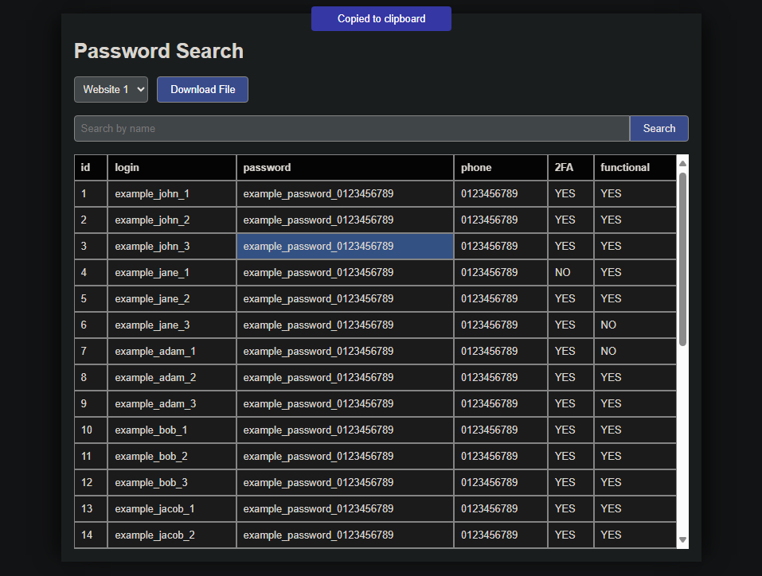

# Password Manager



**A Simple Password Manager**

This password manager is designed to run locally on your machine, providing you with an easy-to-use solution for managing your passwords.

## Installation

To install and run the password manager, follow these steps:

### Prerequisites

- Ensure you have Python installed on your system. The application is compatible with any Python version that supports Flask version 3.0.3.

### Setup

1. Clone this repository to your local machine.
2. Navigate to the repository directory in your terminal.
3. Create a virtual environment by running the following command:

    ```
    python -m venv env
    ```

4. Activate the virtual environment. On Windows, run:

    ```
    call env/scripts/activate
    ```

   On Unix or MacOS, run:

    ```
    source env/bin/activate
    ```

5. Install the required dependencies from `requirements.txt`:

    ```
    pip install -r requirements.txt
    ```

### Running the Application

6. Start the Flask server by running:

    ```
    python flaskapp.py
    ```

7. Open your web browser and navigate to [http://localhost:5000/](http://localhost:5000/).

Now you're ready to start using the password manager!